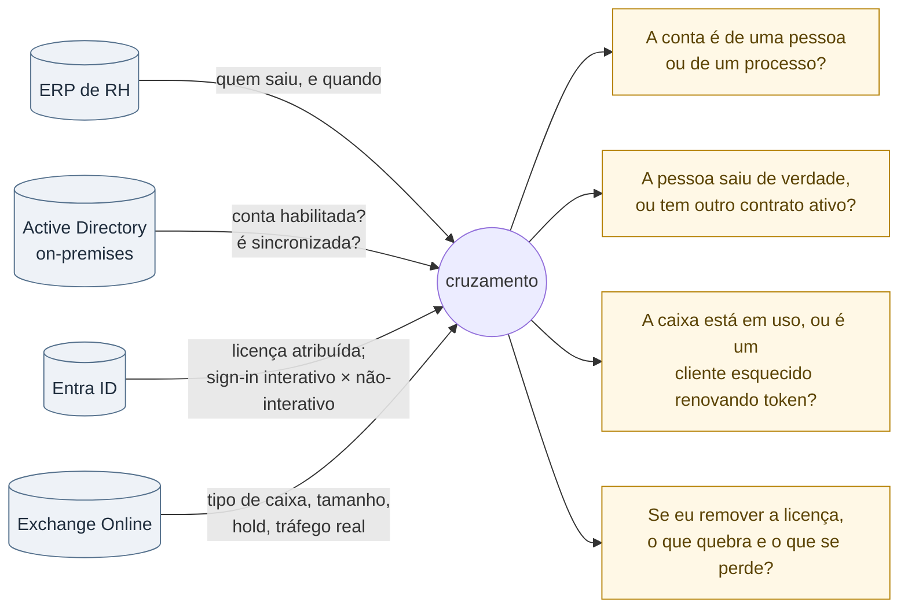
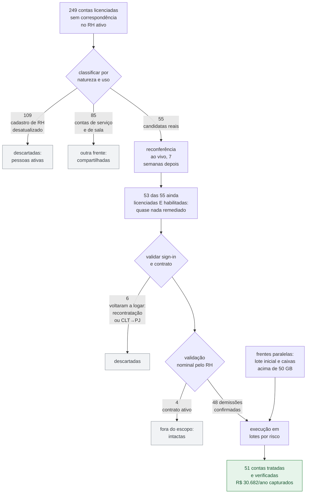
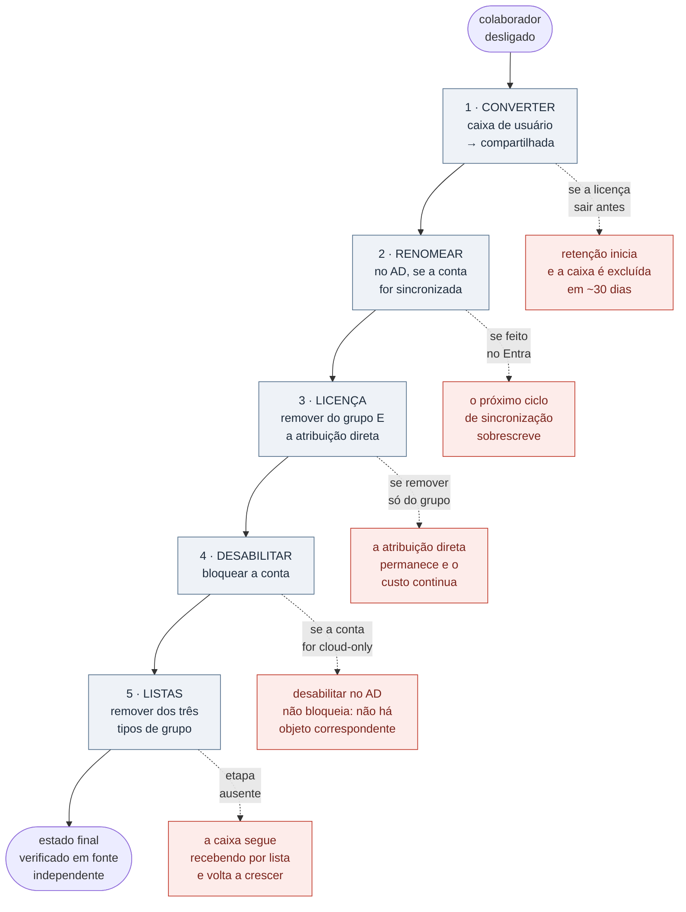
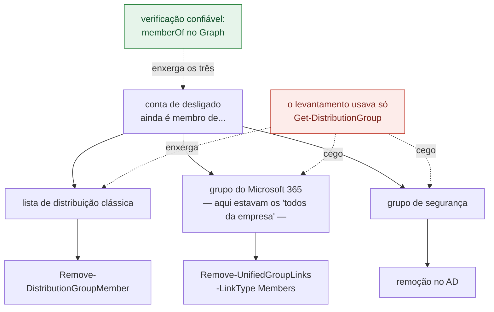

# Governança de licenciamento Microsoft 365: de R$ 74 mil/ano identificados a R$ 30,7 mil/ano capturados

> **Status: sanitizado, pronto para publicação.**
> Nomes de pessoas, domínios, hosts, identificadores de objeto e a razão social
> foram removidos ou generalizados. Os números agregados são reais.

---

## Resumo

Uma auditoria de licenciamento Microsoft 365 em um tenant com ~1.900 caixas de
correio identificou **R$ 74 mil/ano em custo evitável** distribuído em duas
falhas independentes de processo. Dessas, **R$ 30.682/ano foram efetivamente
capturados** em 51 contas tratadas ao longo de 19 dias, com verificação
individual pós-execução.

O que o projeto revelou, porém, foi mais valioso que a economia: o procedimento
de offboarding que a operação executava havia 45 vezes **não removia o
desligado das listas de distribuição**. A consequência era silenciosa e cara —
caixas de pessoas que saíram da empresa continuavam crescendo, e comunicado
interno seguia sendo entregue a quem não tinha mais leitor.

| Indicador | Valor |
|---|---|
| Caixas auditadas | 1.872 |
| Custo evitável identificado | ~R$ 74.000/ano |
| Custo evitável capturado | R$ 30.682/ano |
| Contas tratadas e verificadas | 51 |
| Falsos positivos eliminados antes de agir | 106 de 141 |
| Defeitos de processo descobertos | 2 |

---

## 1. Contexto

Operação corporativa de médio porte, multi-empresa, com:

- Tenant Microsoft 365 com vários domínios irmãos
- Active Directory on-premises sincronizado com o Entra ID
- Licenciamento atribuído **por grupo** e, em parte do parque, **diretamente**
- ERP de RH como fonte de verdade sobre quem está ativo
- Nenhum processo automatizado ligando desligamento no RH a desprovisionamento

Esse último ponto é o que produz o problema. Quando a ligação entre RH e
identidade é manual, a falha não aparece como incidente: aparece como uma linha
de custo que cresce devagar e nunca é questionada.

---

## 2. O problema

Duas falhas independentes, que só ficaram visíveis quando medidas:

**Falha 1 — caixas compartilhadas licenciadas.** No Exchange Online, uma caixa
compartilhada com menos de 50 GB não precisa de licença. Das 901 caixas
compartilhadas do tenant, 810 estavam corretas (sem licença) e **91 continuavam
licenciadas**. Custo: **R$ 3.601,02/mês = R$ 43.212,24/ano**, praticamente todo
evitável. A distribuição de SKUs mostrava a origem histórica do problema —
metade em Exchange Online Plan 1, o restante espalhado em E1, E3, Business Basic
e Exchange Plan 2: eram caixas que um dia foram de pessoa, viraram
departamentais, e ninguém removeu a licença na conversão.

**Falha 2 — pessoas desligadas ainda licenciadas.** O cruzamento entre o ERP de
RH, o Entra ID e o AD on-premises encontrou **249 contas licenciadas que não
constavam como colaborador ativo**. Aqui mora a parte interessante do projeto,
porque a maioria desse número era ruído.

---

## 3. Medir antes de agir

A tentação, diante de "249 contas de gente que saiu", é bloquear tudo numa
sexta-feira à noite. Teria sido um desastre. Três filtros sucessivos derrubaram
o número.

Nenhuma fonte isolada responde à pergunta certa. O trabalho está no cruzamento:

### 3.1 Um status de "demitido" no RH não significa pessoa inativa

Ao cruzar com atividade real de sign-in, **8 de 11 "demitidos licenciados"
verificados estavam em uso ativo**. Recontratação e transição CLT→PJ mantêm o
registro antigo de demissão no ERP — e ler apenas o primeiro contrato da pessoa
marcava como desligado quem estava trabalhando naquele dia. Isso chegou a
produzir uma lista errada de 11 pessoas antes de ser detectado.

**Regra que ficou:** ativo em *qualquer* contrato = ativo. E status de RH nunca
autoriza bloqueio sozinho; a validação de sign-in é obrigatória.

### 3.2 A validação de logon derrubou 75% dos alertas

O script de auditoria original classificava por ausência na lista de ativos.
Depois de passar a consultar a atividade de sign-in via Microsoft Graph, os
**141 casos classificados como severidade "Alta" caíram para 35 reais**. Os
outros 106 eram contas sem uso que não representavam risco, ou contas em uso
cujo cadastro de RH estava desatualizado.

Um detalhe de implementação com consequência prática: `signInActivity` só é
retornado no endpoint de **listagem** de usuários com `$select` explícito — não
vem num GET por UPN. Quem tenta consultar conta a conta conclui que o dado não
existe.

### 3.3 "Está em uso" precisa ser definido melhor

Duas caixas pareciam ativas e travaram o processo por semanas. A investigação
mostrou caixas mortas: **zero e-mail entrando ou saindo em 9 dias** e nenhum
registro de acesso a item de correio na auditoria.

O que confundia era o sign-in. A distinção que resolveu foi separar logon
**interativo** (pessoa digitando senha) de **não-interativo** (token de cliente
renovando sozinho). Uma das caixas tinha sign-in não-interativo diário, mas o
último interativo era de cinco meses antes — era um Outlook esquecido aberto em
alguma estação, não uma pessoa trabalhando.

**Regra que ficou:** antes de assumir que uma caixa compartilhada está em uso,
conferir rastreamento de mensagens (entrada e saída real) **e** o tipo de logon.
Presença de sessão não é evidência de uso.

### 3.4 O discriminador que realmente importava

Com o RH validando a lista nominalmente (48 demissões confirmadas de 52
enviadas), surgiu a métrica que organizou toda a priorização: o **gap entre a
data de demissão e o último logon**.

| Gap | Leitura | Ação |
|---|---|---|
| ≤ 29 dias | Atraso normal de desprovisionamento | Desabilitar |
| 30–60 dias | Zona cinzenta | Confirmar com gestor |
| > 60 dias | **Acesso indevido ou função não transferida** | Investigar antes de agir |

O logon absoluto não diz nada — alguém que saiu ontem e logou ontem é normal.
Alguém que saiu há 146 dias e logou ontem é um problema de segurança, não de
licenciamento. Dez contas caíram nessa faixa e foram tratadas como investigação,
não como economia.

### 3.5 O funil completo

Os 249 do topo e as 51 da base não estão na mesma unidade: o total executado
acumula lotes de frentes paralelas, e a triagem descartou mais contas do que
tratou. É esse o ponto. **Quatro de cada cinco alertas iniciais não eram
acionáveis** — e cada um deles, se executado, teria quebrado o trabalho de
alguém.

---

## 4. Alternativas consideradas e descartadas

Esta é a seção que costuma faltar em relato de projeto, e é onde a decisão
técnica de fato acontece.

### Remover a licença diretamente da caixa do desligado — **descartada**

É o caminho óbvio e destrói dados. Remover a licença de uma caixa de usuário
**inicia o prazo de retenção: a caixa é excluída em ~30 dias**. Em ambiente com
obrigação de retenção de correspondência, isso troca uma economia de R$ 24/mês
por um passivo.

A alternativa correta é converter para caixa compartilhada **antes** de remover
a licença. Compartilhada não precisa de licença até 50 GB e preserva o
histórico. Isso define a ordem obrigatória das etapas — e ela não pode ser
invertida.

### Desabilitar tudo de uma vez — **descartada**

Das 29 contas confirmadas como demitidas e ainda habilitadas, **10 tinham sido
usadas nos últimos 7 dias, 3 delas no próprio dia**. Desabilitar quem está
trabalhando quebra operação, mesmo quando a demissão está formalmente correta —
transições de contrato, função não transferida e acesso residual legítimo são
comuns.

Adotado: divisão em lotes por risco, e não por conveniência.

- **Lote A1 (19 contas, risco baixo):** sem uso em 7 dias. Se houver engano, a
  pessoa percebe e a reversão leva segundos.
- **Lote A2 (10 contas, risco médio-alto):** com uso recente. Confirmação com o
  gestor, caso a caso, antes de qualquer ação.

### Tratar acesso e custo como uma coisa só — **descartada**

Desabilitar a conta corta acesso e **não tem efeito financeiro**. Remover licença
corta custo e não corta acesso de imediato. São dois problemas com urgências,
riscos e aprovadores diferentes.

Separá-los permitiu aprovar e executar o corte de acesso (urgente, risco de
segurança) sem esperar a análise de licenciamento (não urgente, risco de perda
de dados). Uma ação não ficou refém da outra.

### Excluir caixas grandes para caber no limite de 50 GB — **descartada, com uma exceção**

Três caixas estavam acima dos 50 GB que permitem compartilhada sem licença. A
primeira reação foi liberar espaço. Revisando caso a caso:

- Uma delas **já estava sob o limite** (49,94 GB) e já era compartilhada —
  bastava remover a licença. Nenhuma exclusão era necessária. Lição: conferir o
  tamanho atual antes de partir para liberar espaço.
- Outra tinha caixa primária e arquivo ambos na cota, com auto-expansão
  indisponível no SKU atribuído. Não havia como reduzir sem destruir mais de 74
  mil itens arquivados. Com exportação validada, **excluir a caixa** foi a
  decisão correta — e é a única exclusão do projeto inteiro, feita com
  soft-delete e janela de recuperação de 30 dias.

---

## 5. A solução

### Procedimento de offboarding, em ordem não-inversível

Cada etapa tem um modo de falha específico se for pulada ou feita no lugar
errado. É isso que torna a ordem obrigatória, e não uma preferência:

A etapa 5 não existia no procedimento original. Foi acrescentada depois de ser
descoberta pela medição — ver seção 7.

Três casos especiais que o procedimento precisou tratar explicitamente:

- **Contas sincronizadas do AD** (28 de 29): o rename precisa ser feito no AD.
  Renomear no Entra é inútil — o próximo ciclo de sincronização sobrescreve.
- **Contas cloud-only**: o oposto. Desabilitar no AD não bloqueia o M365 porque
  não há objeto correspondente. Rename e disable vão direto no Entra. Verificar
  `onPremisesSyncEnabled` antes de escolher o caminho.
- **Licença dupla** (12 de 29 contas): atribuição por grupo **e** direta. Remover
  só do grupo deixa a direta ativa e o custo continua — com o agravante de que o
  relatório acusa sucesso.

### Governança

Nenhuma execução ocorreu sem aprovação formal registrada. A solicitação de
aprovação declarava escopo, lotes, risco por lote, operação técnica exata, plano
de reversão e o que ficava **fora** do escopo — no caso, as 4 contas que o RH
identificou como contrato ativo e que permaneceram intactas.

Isso não é burocracia: é o que permite executar uma ação em massa sobre
identidades sem que ela dependa da memória de quem executou.

---

## 6. Resultados

### Capturado

**51 contas tratadas, R$ 30.682/ano**, em lotes sucessivos entre 13/08 e 31/08,
cada um verificado individualmente depois da execução (caixa convertida,
renomeada, sem licença, conta desabilitada).

| Lote | Contas | Economia anual |
|---|---:|---:|
| Lote inicial | 8 | R$ 4.819 |
| A1 — desligados sem uso recente | 19 | R$ 9.527 |
| A2 — desligados com uso, após confirmação | 10 | R$ 9.764 |
| Caixas acima de 50 GB | 3 | R$ 2.244 |
| Demais | 11 | R$ 4.328 |

A maior economia isolada foi **R$ 1.668/ano em uma única conta** — uma caixa de
62 GB com licença E3, cujo tratamento exigiu exportação prévia de mais de 83 mil
itens.

### Identificado, pendente de decisão

As **91 caixas compartilhadas licenciadas (R$ 43.212/ano)** seguem aguardando
aprovação. A análise de bloqueadores já foi feita e o resultado surpreendeu:

Das 13 caixas suspeitas de terem integração ativa (padrões `noreply`, alertas
de sistema, conciliação), **apenas uma tinha autenticação SMTP habilitada — e
estava morta desde 2022**. As demais herdam a autenticação do tenant, sem envio
autenticado próprio, e continuam funcionando sem licença.

Ou seja: **integração não era o bloqueador real**. O bloqueador é outro —
tamanho acima de 50 GB ou retenção legal ativa. É isso que o pré-voo pendente
precisa medir, caixa a caixa, antes de qualquer remoção de licença.

Vale registrar como pendência honesta: essa frente está identificada e
justificada, mas **não capturada**. Enquanto não houver o pré-voo e a aprovação,
o valor é potencial, não realizado.

---

## 7. O defeito de processo que a medição revelou

Este é o resultado mais importante do projeto, e não foi o objetivo dele.

O procedimento de offboarding já havia sido executado **45 vezes**. Ao verificar
o estado final das contas tratadas, apareceu o problema: **21 de 23 contas
verificadas continuavam recebendo correio de listas de distribuição.**

Dois efeitos, ambos silenciosos:

1. **As caixas continuavam crescendo.** Uma delas ganhou 2 GB e quase 4 mil
   itens em 4 dias — *durante* o processo de liberação de espaço, desfazendo o
   trabalho em tempo real. Nenhum e-mail direto: tudo entrava por lista. O
   rastreamento por destinatário não detecta entrega via lista de distribuição,
   o que explica por que ninguém tinha visto isso antes.
2. **Comunicado interno e e-mail operacional sendo entregues em caixa sem
   leitor** — uma falha de comunicação interna que ninguém havia associado ao
   offboarding.

A causa de a etapa ter sido esquecida é técnica e instrutiva: **são três tipos
de grupo, cada um com seu próprio cmdlet**, e o comando mais óbvio não enxerga
os maiores.

| Tipo | Como remover |
|---|---|
| Lista de distribuição clássica | `Remove-DistributionGroupMember` |
| **Grupo do Microsoft 365** | `Remove-UnifiedGroupLinks -LinkType Members` |
| Grupo de segurança | Remover no AD |

Os grupos que concentravam a maior parte das entregas — os "todos da empresa" —
eram do segundo tipo, invisíveis para quem consultava apenas listas clássicas:

O erro não foi de execução: foi de **instrumento de verificação**. O comando
usado para conferir o resultado era cego justamente para o caso que mais
importava, então o procedimento passou 45 vezes por uma checagem que nunca
poderia reprová-lo. A verificação confiável é via `memberOf` no Graph, que
enxerga os três tipos.

Uma ressalva que também virou regra: listas geradas automaticamente a partir da
base de RH se autocorrigem no próximo sincronismo — remover manualmente é
trabalho perdido. Só as listas estáticas exigem remoção manual.

**Dívida de higiene encontrada de passagem:** 8 grupos do tenant com entrada
sujeita a aprovação e **nenhum dono definido** — ninguém no mundo consegue
aprovar entrada neles.

---

## 8. Armadilhas técnicas

Registradas porque custaram tempo e nenhuma estava documentada:

**Um script pode relatar sucesso sem fazer nada.** No PowerShell 5.1, a chamada
ao Graph devolve hashtable, e `Select-Object -ExpandProperty` falha
silenciosamente sobre ela. O script concluía "conta já sem licença" e seguia
adiante — sem ter removido licença alguma. Solução: acesso por chave
(`$obj['k']`) ou executar em PowerShell 7. Depois disso, toda execução passou a
ter verificação independente do resultado, em vez de confiar no log.

**A API de licenciamento recusa o lote inteiro por um item.** `assignLicense`
retorna `BadRequest` se a lista de remoção incluir um SKU que já não está
atribuído. É preciso remover apenas o que consta em `assignedLicenses` — o que
significa ler o estado antes de cada escrita, não montar a lista a partir da
expectativa.

**Uma exclusão que o cliente confirma pode nunca ter chegado ao servidor.** O
diagnóstico confiável é a pasta `Deletions` (ou `TotalDeletedItemSize`): se está
em 0 B, nada aconteceu, por mais que o Outlook diga que apagou. Três tentativas
de esvaziar uma lixeira pela interface falharam exatamente assim.

**Exclusão em massa trava; item a item passa.** Onde a exclusão de pasta grande
falhava, a exclusão individual via Graph funcionou. E um atalho útil: mover para
itens recuperáveis **já libera a cota** — a pasta de recuperáveis não conta nos
50 GB —, então nem sempre é preciso exclusão permanente.

**Estancar a entrada vem antes de liberar espaço.** Já dito acima, mas é a
lição mais cara: liberar espaço numa caixa que continua recebendo é trabalho que
se desfaz sozinho.

**Propagação não é instantânea.** O bloqueio no AD leva cerca de 30 minutos para
chegar ao Entra pelo AD Connect. Verificar antes disso produz falso negativo e
retrabalho.

**Cuidado com a etapa que remove o próprio acesso.** No script original, o bloco
que removia a permissão de acesso total do executor rodava antes do fim — e
derrubava o acesso no meio do trabalho.

---

## 9. Um falso positivo que vale mencionar

O script de auditoria original tratava a combinação de uma licença de BI com o
SKU base como conflito de licenciamento, gerando **9 falsos positivos**. Não é
conflito: trata-se de um **add-on**, atribuído por cima da licença base de
propósito, porque o SKU base não inclui aquele serviço.

Conflito real é acúmulo de dois SKUs **base** (dois planos que cobrem o mesmo
escopo). A regra corrigida distingue base de add-on antes de classificar — e
qualquer add-on novo entra por esse mesmo critério.

É um erro pequeno com uma lição grande: uma regra de auditoria errada não
produz apenas ruído, ela produz **recomendações de remoção de licença que
quebrariam o trabalho de nove pessoas**.

---

## 10. O que aconteceu três semanas depois

Este estudo descreveria uma sequência de acertos se parasse aqui. Não para.

Em 24/08, no mesmo tenant e no mesmo terreno — políticas de retenção e operação
em massa sobre caixas —, **uma tag de expurgo foi anexada à política errada e
apagou cerca de 1,18 milhão de itens em 732 caixas** que não tinham relação
nenhuma com o objetivo da mudança. **Dezessete itens se perderam em definitivo**;
o restante veio de volta pela retenção.

Duas circunstâncias pioram o quadro, e são elas que carregam a lição.

**Ninguém detectou.** O incidente veio à tona pelo relato de uma usuária que
sentiu falta de mensagens. Nenhum alerta, nenhuma verificação pós-execução e
nenhum painel apontaram uma deleção dessa magnitude.

**A causa raiz foi uma comparação de texto.** A política de destino era
identificada por nome, e o trecho que fazia essa correspondência tinha um
defeito. A tag foi parar em outro objeto — que por acaso estava vinculado a 732
caixas.

A regra que saiu dali vale para qualquer objeto compartilhado de tenant:
política de retenção, acesso condicional, regra de transporte, grupo de
licenciamento, política de grupo.

> **Antes de alterar, enumere quem mais está vinculado ao objeto — e olhe essa
> lista.** O alcance de uma mudança em objeto compartilhado não é o que você
> pretende atingir; é tudo que aponta para ele. Quem não consegue enumerar isso
> antes de executar não sabe o tamanho do que está fazendo.

É o inverso exato do que funcionou nas 51 contas deste estudo. Lá, cada conta era
um objeto isolado, tratada em lote pequeno, com verificação individual depois.
Aqui, um único objeto compartilhado, sem enumeração prévia e sem verificação
posterior — e três ordens de grandeza a mais de dano.

Registro isto porque um estudo de caso que só mostra o que deu certo é
propaganda, não referência técnica. E porque esta é, de longe, a lição mais
transferível do conjunto.

---

## 11. O que eu faria diferente

1. **Pré-voo de tamanho e retenção primeiro.** Medir tamanho e holds de todas as
   caixas candidatas *antes* de montar qualquer lote teria evitado descobrir
   bloqueadores no meio da execução — inclusive a caixa que já estava sob o
   limite e não precisava de intervenção nenhuma.
2. **Mapear as listas antes de tratar a primeira conta.** O defeito das listas de
   distribuição só apareceu depois de 45 execuções. Uma verificação de estado
   final desde a primeira teria revelado na primeira.
3. **PowerShell 7 desde o início, sem exceção.** A falha silenciosa do 5.1 custou
   confiança em resultados já produzidos e obrigou a reverificar lotes.
4. **Verificação independente como parte do procedimento, não como auditoria
   posterior.** Todo script de mudança em massa deveria terminar lendo o estado
   final de uma fonte diferente da que escreveu.
5. **Atacar a causa, não o acúmulo.** O projeto trata o estoque. Enquanto a
   ligação entre desligamento no RH e desprovisionamento for manual, o estoque
   se refaz. A automação desse gatilho é o trabalho que realmente encerra o
   problema — e ainda está pendente.

---

## 12. Stack

**Microsoft Graph** (usuários, licenças, `signInActivity`, `memberOf`, operações
de correio) · **Exchange Online PowerShell** (caixas, estatísticas, grupos,
rastreamento de mensagens) · **Active Directory** on-premises · **PowerShell 7**
· **Python** (geração de painel) · autenticação **app-only com certificado**,
com permissões restritas ao escopo mínimo necessário.

---

## Apêndice — o que este projeto mede que um relatório de licenças não mede

Um relatório de licenciamento responde "quantas licenças estão atribuídas".
As perguntas que de fato importavam eram outras:

- Esta conta é de uma **pessoa** ou de um **processo**?
- Esta pessoa saiu de verdade, ou tem outro contrato ativo?
- Esta caixa está **em uso**, ou tem um cliente esquecido renovando token?
- Se eu remover esta licença, **o que quebra** — e o que se perde para sempre?
- O procedimento que eu executei 45 vezes **realmente fez** o que eu penso que fez?

Nenhuma delas é respondida por contagem. Todas são respondidas por cruzamento de
fontes independentes — e é esse cruzamento, não o número final, que constitui o
trabalho.
