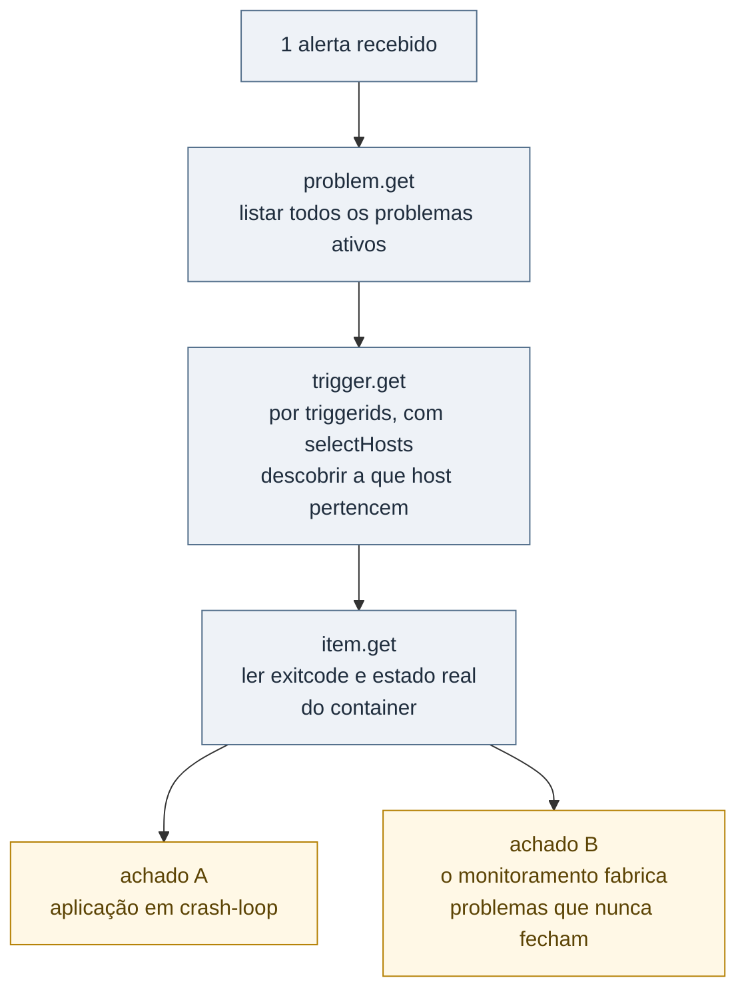
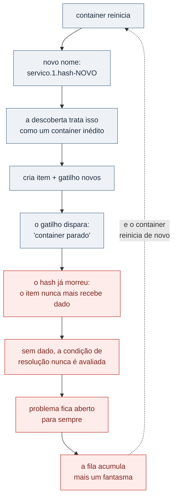
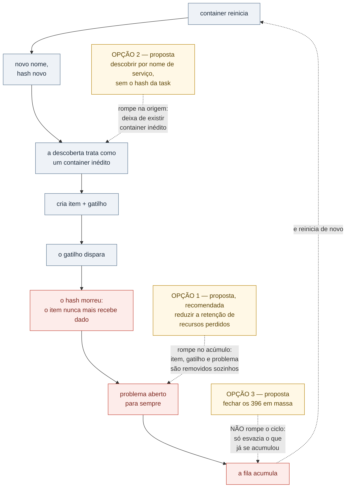

# O monitoramento como fonte do incidente: 95% dos alertas eram fantasmas

> **Status: sanitizado, pronto para publicação.**
> Razão social, domínios, hostnames, IPs, tokens e nomes de serviços internos
> foram removidos ou generalizados. Os números são reais.
>
> **Este é um estudo de diagnóstico, não de remediação.** A análise está
> concluída e a correção foi proposta com plano de execução, mas **não foi
> aplicada** — depende de aprovação. A seção 8 diz exatamente o que falta. Um
> relato que fingisse conclusão aqui seria mais bonito e menos verdadeiro.

---

## Resumo

Uma investigação que começou com **um único alerta** terminou revelando que o
sistema de monitoramento estava produzindo **396 dos 418 problemas ativos** —
95% do que o time via como "a fila de alertas" eram fantasmas que nunca iriam
se resolver sozinhos.

A causa não era o volume de incidentes. Era um anti-padrão de projeto: a regra
de descoberta automática identificava containers por um nome que **inclui um
identificador efêmero**, em um ambiente onde esse identificador muda a cada
reinício por design. Cada reinício criava um item e um gatilho novos, que
disparavam uma vez e ficavam abertos para sempre — porque o objeto que eles
vigiavam deixava de existir no instante seguinte.

E há uma ironia estrutural no caso: a aplicação quebrada que o alerta original
apontava era **a própria geradora do ruído que a escondia**. Cada vez que ela
reiniciava, fabricava mais um fantasma na fila.

| Indicador | Valor |
|---|---|
| Problemas ativos no Zabbix | 418 |
| Gatilhos zumbis de um único host | 396 (~95%) |
| Alertas reais estimados após a correção | algumas dezenas |
| Problemas independentes encontrados | 2 |
| Alertas que originaram a investigação | 1 |

---

## 1. Contexto

Ambiente de monitoramento corporativo com Zabbix 6, cobrindo servidores,
serviços e containers distribuídos em vários sites. Parte da carga roda em
**Docker Swarm**, gerenciado por um painel de containers, em um host remoto.

O monitoramento de containers usa **LLD** (*Low-Level Discovery*) — o mecanismo
pelo qual o Zabbix descobre sozinho o que existe no host e cria itens e gatilhos
automaticamente, sem cadastro manual. É um recurso excelente e é exatamente onde
o problema nasce.

---

## 2. O ponto de partida

Um alerta. A investigação poderia ter terminado em cinco minutos com "container
reiniciando, reiniciar de novo". Em vez disso, a pergunta foi outra: *este
alerta é representativo do que mais está na fila?*

A resposta veio da API, em três chamadas encadeadas:



Dois problemas independentes, encontrados na mesma investigação, com urgências e
donos diferentes. Tratá-los como um só teria atrasado os dois.

---

## 3. Achado A — a aplicação em crash-loop

Um serviço interno de migração de banco reiniciava **ininterruptamente havia 6
dias: cerca de 97 reinícios**, sem nunca subir.

O diagnóstico decisivo veio do código de saída, lido diretamente pelo item do
Zabbix:

| Código de saída | Significado | Conclusão |
|---:|---|---|
| 0 | encerramento limpo | não é o caso |
| 137 | morto pelo sistema (memória) | **não é o caso** |
| **1** | **erro da própria aplicação** | **é este** |

Isso muda completamente o encaminhamento. `137` seria um problema de
infraestrutura — subir limite de memória resolveria. `1` significa que a
aplicação está falhando na subida por conta própria, e nenhum ajuste de
infraestrutura vai corrigir. O caminho é ler o log da aplicação e olhar o que
mudou no último deploy.

Havia um suspeito plausível: mudanças recentes no runner de migrações do próprio
projeto. Mas suspeito plausível não é causa raiz, e é aqui que este estudo
para — ver a seção 8.

---

## 4. Achado B — o mecanismo do gatilho zumbi

Este é o achado que importa, e ele é um erro de projeto, não de configuração.

Em Docker Swarm, cada execução de um serviço é uma *task*, e o nome do container
carrega um identificador único da task:

```
nome-do-servico.1.<hash-da-task>
```

Esse hash **muda a cada reinício**. É assim por design: a task anterior morreu, a
nova é outra entidade.

A regra de descoberta do template estava configurada para identificar containers
pelo **nome completo, hash incluído**. O resultado é um ciclo que só cresce:



O detalhe que torna isso pernicioso: **um gatilho zumbi não é um alerta errado,
é um alerta verdadeiro e imortal**. O container *de fato* parou. A informação
estava correta no instante em que disparou. O que não existe é qualquer caminho
para que ele se resolva — porque resolução dependeria de um objeto que nunca
mais vai reportar nada.

Sistemas de monitoramento sabem fechar problemas quando a condição inversa é
observada. Ninguém projetou o caso em que **a entidade observada deixa de
existir**. É uma lacuna conceitual, não um bug.

### A composição do ruído

**396 dos 418 problemas ativos — 94,7% — eram gatilhos zumbis de um único host.**

Vinte e dois problemas para um ambiente inteiro é uma fila administrável. 418 não
é. E o padrão não estava isolado: outro serviço do ambiente repetia o mesmo
comportamento em menor escala (40 e 27 ocorrências em duas instâncias),
confirmando que a causa era o template, não aquele host.

---

## 5. A ironia estrutural

Vale isolar o que a combinação dos dois achados produz, porque é a parte do caso
que se aplica muito além do Zabbix:

**A falha real fabricava o ruído que a tornava invisível.**

Cada reinício da aplicação quebrada criava mais um gatilho zumbi. Quanto pior o
incidente ficava, mais alto ficava o ruído — e menor a chance de alguém enxergar
o incidente dentro dele. Um operador olhando a fila via centenas de linhas
idênticas dizendo "container parado" no mesmo host. A resposta humana natural a
isso é parar de olhar.

É a definição de **fadiga de alerta**, com uma volta a mais: o mecanismo de
alerta não estava apenas gerando ruído demais, estava **convertendo um incidente
ativo em ruído de fundo**.

O risco que isso cria não é o incidente conhecido. É o próximo — o alerta
legítimo e diferente que chegar enquanto a fila estiver assim, e que ninguém vai
ver.

---

## 6. Alternativas de correção

Três caminhos possíveis, com trade-offs distintos. A recomendação não é a mais
elegante: é a que tem melhor relação entre efeito e risco.

### Opção 1 — Reduzir o período de retenção de recursos perdidos *(recomendada)*

O Zabbix tem um parâmetro na regra de descoberta que define por quanto tempo
manter itens e gatilhos de recursos que sumiram. Baixá-lo para algo curto (ex.:
1 hora) faz o próprio Zabbix limpar item, gatilho e problema quando o container
desaparece.

- **A favor:** um único parâmetro, reversível, sem tocar na lógica de descoberta,
  e resolve o acúmulo de forma automática e permanente.
- **Contra:** não impede a criação dos itens efêmeros, só faz a faxina depois.
  Há uma janela em que o ruído ainda aparece.

### Opção 2 — Descobrir por nome de serviço, sem o hash

Ajustar o filtro da descoberta para agrupar por nome de serviço, ignorando o
identificador de task, ou excluir tasks efêmeras via override.

- **A favor:** ataca a causa raiz. O monitoramento passa a vigiar a entidade
  correta — *o serviço*, que é estável — em vez da task, que é descartável.
- **Contra:** mexer em regra de descoberta afeta todos os hosts que usam o
  template, exige teste cuidadoso e tem potencial de criar pontos cegos se o
  filtro for amplo demais.

### Opção 3 — Fechar os 396 problemas em massa

- **A favor:** alívio imediato e visível.
- **Contra:** **isoladamente, não é correção — é maquiagem.** Sem os ajustes
  acima, a fila volta ao mesmo estado, e mais rápido do que antes enquanto a
  aplicação seguir reiniciando.

### Onde cada opção romperia o ciclo

O mesmo ciclo da seção 4, agora com o ponto de interrupção de cada proposta.
Repare que a Opção 3 não toca no ciclo em lugar nenhum — é isso que a torna
maquiagem quando aplicada sozinha:



**Nenhuma das três foi aplicada.** O diagrama descreve o efeito esperado de cada
proposta, não um resultado observado.

### Encaminhamento proposto

Opção 1 primeiro (baixo risco, efeito imediato), Opção 2 em seguida como
correção estrutural com teste em um host antes de generalizar, e **só então** a
limpeza em massa — que deixa de ser maquiagem quando a causa já foi tratada.

A ordem importa: fechar os problemas antes de corrigir a descoberta desperdiça o
trabalho, exatamente como esvaziar uma caixa de correio que continua recebendo.

---

## 7. Armadilhas da API

Detalhes que custaram tempo e não estavam documentados de forma óbvia:

**O método de versão é o único que não pode ser autenticado.** `apiinfo.version`
**deve** ser chamado sem o cabeçalho de autorização — com ele, retorna erro
`-32602`. É contraintuitivo: o primeiro método que se chama para testar a
conexão é justamente o que quebra se você já configurou a autenticação.

**`problem.get` não aceita `selectHosts`.** Não dá para descobrir de qual host
veio um problema em uma chamada só. É preciso pegar o `objectid` (que é o
`triggerid`) e fazer uma segunda chamada a `trigger.get` com `selectHosts`. Isso
transforma uma consulta trivial em um encadeamento de três chamadas.

**Booleanos precisam ser booleanos de verdade.** Passar `"false"` como string em
vez do valor booleano faz a API interpretar como verdadeiro — e o resultado vem
silenciosamente errado, sem erro. É o tipo de falha que leva a conclusões
incorretas com dados de aparência plausível.

**Onde ler o estado real de um container:** `item.get` filtrado por `triggerids`,
nas chaves de estado do container — código de saída e flag de execução. É o que
permitiu distinguir erro de aplicação de falta de memória sem acesso ao host.

---

## 8. O que ficou em aberto

Registrado com franqueza, porque um estudo de caso que omite o que não fechou
não serve como referência técnica:

1. **A causa raiz do crash-loop não foi determinada.** O que existe é uma
   hipótese razoável ligada a mudanças recentes no runner de migrações. Fechar
   exige ler o log do container no próprio host — e a investigação foi conduzida
   de outra máquina, sem acesso àquele host. Os comandos necessários foram
   entregues junto com o diagnóstico, para quem tem o acesso.
2. **Nenhuma correção foi aplicada.** As três opções estão propostas e
   priorizadas; a execução depende de aprovação, conforme a governança do
   ambiente. Até aqui, só leitura e diagnóstico.
3. **O ganho de 418 → algumas dezenas é projeção, não medição.** É uma estimativa
   fundamentada — 396 dos 418 têm causa única e identificada —, mas não foi
   verificada na prática, e não deve ser apresentada como resultado obtido.

Essa distinção entre **analisado** e **capturado** é deliberada. Diagnóstico bem
feito tem valor próprio; apresentá-lo como remediação concluída não.

---

## 9. A lição transferível

O erro específico é do template Docker do Zabbix. O erro *geral* é muito mais
comum:

> **Monitoramento que ancora identidade em um identificador efêmero, dentro de um
> ambiente onde a identidade é efêmera por design.**

O mesmo padrão aparece em pod de Kubernetes recriado com nome novo, instância de
autoescala que sobe e desce, runner de CI descartável, função serverless por
invocação. Em todos, a pergunta de projeto é a mesma e raramente é feita:

**O que eu estou vigiando — a entidade que precisa existir, ou a encarnação atual
dela?**

A resposta certa quase sempre é a primeira. O serviço precisa estar de pé; *esta*
task específica é descartável e sua morte é um evento normal, não um incidente.
Quando o alerta é ancorado na encarnação, dois efeitos aparecem juntos: ruído que
cresce sem limite, e o desaparecimento do sinal de verdade dentro dele.

Um corolário prático, que vale como critério de revisão de qualquer regra de
alerta nova:

> **Todo alerta precisa ter um caminho possível de resolução.** Se não existe
> condição observável capaz de fechá-lo, ele não é um alerta — é um registro de
> evento fingindo ser um. E vai poluir a fila para sempre.

---

## 10. Stack

**Zabbix 6** (API JSON-RPC, autenticação por token, LLD de containers) ·
**Docker Swarm** · **PowerShell** para consumo da API · leitura de estado de
container via itens do próprio monitoramento, sem acesso ao host.

---

## Apêndice — por que isso não apareceu antes

O ambiente tinha 418 problemas ativos havia tempo suficiente para que aquilo
fosse considerado normal. Ninguém tinha errado: cada gatilho individual estava
tecnicamente correto no momento em que disparou.

O que faltava era alguém fazer a pergunta de agregação — *destes 418, quantos são
a mesma coisa?* — em vez da pergunta individual, *o que é este alerta?*.

Foi só isso. Uma chamada de API listando tudo e agrupando por host e por tipo. O
diagnóstico inteiro decorre desse agrupamento, e ele levou minutos.

A lição de método é essa: **em fila de alertas, a estatística vem antes do
caso**. Olhar alerta por alerta em uma fila contaminada é trabalhar muito para
aprender pouco.
