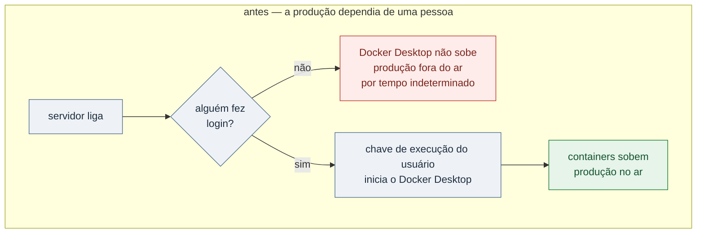
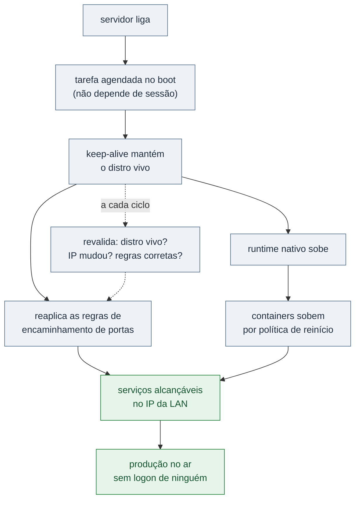
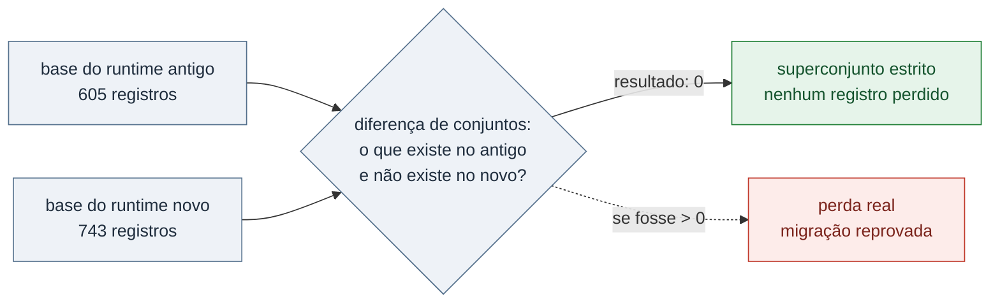
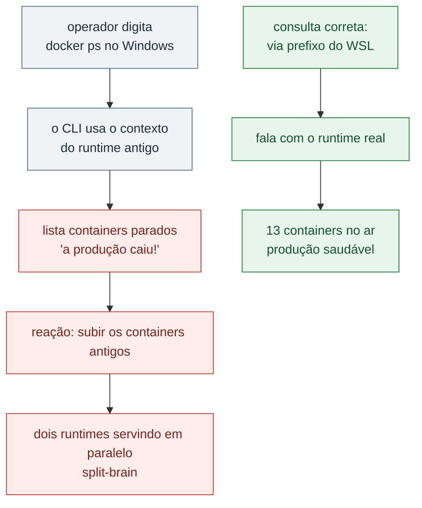

# Quando a produção depende de alguém fazer login: migração de runtime de containers sem downtime

> **Status: sanitizado, pronto para publicação.**
> Razão social, domínios, hostnames, IPs, contas, nomes de containers, chaves e
> caminhos locais foram removidos ou generalizados. Datas, contagens e
> resultados são reais.
>
> **Este é um estudo de remediação concluída e validada.** A migração foi
> executada, o runtime antigo foi aposentado e a ausência de perda de dados foi
> comprovada por diferença de conjuntos, não por inspeção. A seção 11 registra o
> que permanece sem prova.

---

## Resumo

Um servidor Windows hospedava toda a operação de inventário e as aplicações
internas em containers sob **Docker Desktop**. A análise de configuração revelou
um problema que nenhum monitoramento apontava e nenhum incidente havia exposto:

**O Docker Desktop só sobe pela chave de execução de um usuário específico, no
logon. Não sobe no boot.** Ou seja: qualquer reboot sem que aquela pessoa
fizesse login deixaria a produção inteira fora do ar até que alguém logasse. O
risco estava latente apenas porque uma sessão remota permanecia aberta havia
seis semanas.

A migração para **Docker CE nativo no WSL** levou cinco semanas, teve **uma
tentativa fracassada com rollback**, dois caminhos de rede testados e
descartados, e um bug de identidade que travou tudo por oito dias. O desfecho
foi atípico: o cutover final **nunca precisou ser executado manualmente** — o
runtime antigo caiu sozinho antes da janela planejada e o mecanismo de
contingência assumiu, em produção, sem intervenção.

| Indicador | Valor |
|---|---|
| Containers migrados | 13 |
| Endpoints validados na LAN | 9 de 9 |
| Perda de dados | **zero**, comprovada por diferença de conjuntos |
| Tempo de recuperação automática medido | ~2 min 15 s |
| Tentativas de cutover fracassadas | 1 (com rollback em segundos) |
| Caminhos de rede testados e descartados | 2 |
| Bugs pré-existentes revelados pela migração | 4 |

---

## 1. O problema real

É tentador resumir isto como "trocamos Docker Desktop por Docker CE". Não é esse
o caso. O problema era de **arquitetura de disponibilidade**, e o runtime era
apenas onde ele se manifestava.

A cadeia de dependência da produção era esta:

O serviço de sistema do Docker Desktop estava em **Parado / Manual**. Não havia
nenhum caminho de inicialização que não passasse por uma sessão interativa.

### A falsa segurança das políticas de reinício

Todos os containers tinham política de reinício configurada (`unless-stopped`,
`always`). Isso dá uma sensação confortável de resiliência — e é enganosa:

> **Política de reinício de container só atua com o daemon de pé.** Se o daemon
> não sobe, a política não existe. Ela protege contra a queda de um container,
> nunca contra a ausência do runtime.

Esse é o tipo de detalhe que faz um ambiente parecer redundante no papel e não
ser. O container tinha plano de recuperação; o processo que executa esse plano,
não.

### Como foi descoberto

Não por incidente. Por **leitura de configuração** — verificar como cada serviço
de produção efetivamente inicia, em vez de assumir que "está rodando, então sobe
sozinho". A latência do risco era acidental: a sessão remota aberta havia
semanas mascarava o problema por completo.

Vale dizer o que isso significa em termos de risco: o ambiente estava a **um
reboot de distância** de uma indisponibilidade que só terminaria quando uma
pessoa específica estivesse disponível para fazer login.

---

## 2. A linha do tempo

A migração não foi linear, e o valor do caso está justamente nos desvios:

| Data | O que aconteceu | Desfecho |
|---|---|---|
| **06/07** | Cutover executado | **Falhou** — modo de rede NAT não expõe na LAN. Rollback em segundos |
| **06/07** | Causa raiz encontrada | O WSL encerra o distro por ociosidade: autostart não basta, precisa de keep-alive |
| **12/07** | Rota A testada — rede espelhada | **Revertida** — incompatível com o runtime antigo em execução |
| **02/08** | Keep-alive falha ao elevar privilégio | Bloqueado, causa desconhecida por 8 dias |
| **10/08** | Bug identificado: duas contas homônimas | Rota B liberada |
| **11/08** | O runtime antigo cai sozinho | **A contingência assume em produção, sem intervenção** |
| **13/08** | Serviços restantes migrados | Teste de queda controlada: recuperação em ~2min15s |
| **18/08** | O endereço do distro muda sozinho | Regras reaplicadas automaticamente — último caminho provado |
| **24/08** | Validação completa | Zero perda comprovada; runtime antigo aposentado |

---

## 3. Tentativa 1: falhou e sofreu rollback

O primeiro cutover foi executado e **não funcionou**. Vale registrar porque o
fracasso foi bem conduzido.

**O bloqueador:** o WSL estava em modo **NAT**. Nesse modo, as portas publicadas
dentro do distro aparecem apenas em `127.0.0.1` — **não no IP da LAN**, que é
justamente o endereço que os agentes de inventário usam para reportar. Com o
runtime novo no ar, a porta 80 na LAN passou a responder `HTTP 000`: agentes sem
coleta.

**O rollback levou segundos**, porque havia um: parar o compose no runtime novo e
subir os containers no antigo. Produção restaurada e validada — códigos de
resposta conferidos e contagens de dados intactas.

O que a tentativa fracassada deixou de aproveitável foi substancial: o
procedimento de dump e restore validado, o ajuste de portas do compose, e a
descoberta de que o bind da porta 80 pelo WSL funcionava sem privilégio
administrativo. **Um cutover que falha mas produz conhecimento reutilizável e
volta ao estado anterior em segundos não é um fracasso caro — é um teste.**

A condição para isso é ter decidido o critério de rollback *antes*, não durante.

---

## 4. A causa raiz que mudou o projeto

Da tentativa fracassada saiu a descoberta que redefiniu a solução:

> **O WSL encerra o distro por ociosidade.** Quando isso acontece, os containers
> param — independentemente de política de reinício, porque o próprio ambiente
> que os hospeda deixou de existir.

A consequência de projeto é direta e não é óbvia: **não bastava configurar
inicialização automática.** Um distro que sobe no boot e é encerrado vinte
minutos depois por inatividade não resolve nada. Era necessário um mecanismo de
**keep-alive** — algo que mantivesse o distro vivo e revalidasse o estado
periodicamente.

Uma tentativa interina de keep-alive por processo em segundo plano foi testada e
**não segurou**: o WSL encerrava assim mesmo, e cada acesso subsequente
disparava uma inicialização a frio.

---

## 5. Alternativas de rede: duas descartadas

Com o NAT eliminado, restavam dois caminhos para expor os serviços do distro na
LAN.

### Rota A — rede espelhada *(testada e revertida)*

O WSL oferece um modo de rede espelhada, em que o distro compartilha as
interfaces do host. É a solução elegante: sem tradução, sem regras, o IP da LAN
funciona naturalmente.

**Testada em 12/07 e revertida no mesmo dia.** O modo espelhado é **incompatível
com o runtime antigo em execução** — quebra o encaminhamento de portas do backend
dele. A porta 80 passou a responder o serviço errado com `404`, a tabela de
encaminhamento embaralhou e foi preciso reiniciar containers para desfazer.

Isso deixou a rota A viável apenas com o runtime antigo **totalmente encerrado**,
ou seja: validável somente dentro da janela de cutover, **sem possibilidade de
fallback quente**. Rota elegante, risco inaceitável — descartar o plano B para
testar o plano A é exatamente o que não se faz em migração de produção.

Uma armadilha adicional ficou documentada: derrubar o WSL derruba junto o backend
do runtime antigo por cerca de 20 segundos e pode embaralhar o encaminhamento.
**Sempre revalidar *quem* está respondendo a porta** — conferindo cabeçalho ou
cookie da resposta, não apenas se responde.

### Rota B — encaminhamento de portas do IP da LAN *(escolhida)*

Regras de `portproxy` mapeando o IP da LAN para o endereço interno do distro.
Menos elegante: exige privilégio administrativo, e as regras precisam ser
reaplicadas quando o endereço interno muda.

**A favor:** coexiste com o runtime antigo em execução. Isso permitia migrar
serviço a serviço, mantendo o antigo como fallback quente — e foi isso que
tornou a migração incremental possível.

A escolha aqui não foi pela melhor arquitetura. Foi pela arquitetura que
permitia **errar sem derrubar a produção**.

---

## 6. O bug que travou tudo por oito dias

O keep-alive estava configurado, rodava, e todas as regras de encaminhamento
falhavam com "requer elevação". A tarefa estava marcada para executar com
privilégio máximo. A conta estava no grupo de administradores. Nada disso era
falso — e mesmo assim não funcionava.

A causa, encontrada oito dias depois:

> A tarefa rodava como a conta **de domínio**. Quem estava no grupo local de
> administradores era a conta **local homônima** — mesmo nome de usuário,
> identidades completamente diferentes.

Duas contas com o mesmo nome, uma do domínio e outra local. Toda a verificação
visual batia: o nome no grupo era o nome da conta da tarefa. Só que nome não é
identidade — o identificador de segurança é. A correção foi adicionar a conta de
domínio ao grupo local, e as regras passaram a aplicar na primeira execução.

**Lição transferível:** em ambiente com domínio, ao diagnosticar permissão,
comparar o **identificador**, nunca o nome exibido. Nome homônimo entre escopos
diferentes é uma armadilha que resiste a toda inspeção superficial — e a
mensagem de erro não dá nenhuma pista, porque do ponto de vista do sistema não há
erro nenhum: a conta que pediu elevação realmente não a tem.

---

## 7. O cutover que se executou sozinho

Com a rota B funcionando, o plano era um cutover em janela controlada.

**Em 11/08, o runtime antigo caiu por conta própria** — antes da janela.

E aí aconteceu a melhor validação possível, porque não foi encenada: o keep-alive
detectou, o distro subiu, o runtime novo levantou a stack pelas políticas de
reinício, e o encaminhamento publicou as portas na LAN. **A produção seguiu
servindo sem nenhuma intervenção humana.**

A arquitetura final ficou assim:

Os serviços restantes foram migrados em 13/08, em ordem deliberada: inventário
primeiro (o mais isolado), depois as aplicações internas, por último os serviços
acessórios.

### Os testes que foram feitos de propósito

- **Queda controlada do WSL (13/08):** recuperação completa e autônoma em **~2
  min 15 s** — distro sobe, runtime pronto, regras reaplicadas, todos os
  containers e serviços de volta. Observação útil: um dos serviços demora cerca
  de 1 min 30 s a mais que os demais porque inicializa banco e migrações. **Isso
  não é falha** — e sem medir, seria lido como falha.
- **Mudança de endereço interno (18/08):** era o único caminho que faltava provar,
  porque o teste anterior reutilizou o mesmo IP por acaso. Em 18/08 o endereço do
  distro mudou sozinho e o keep-alive reaplicou todas as regras com o endereço
  novo, sem intervenção. **Caminho provado em produção, não em laboratório.**

---

## 8. Como se prova "zero perda de dados"

Esta seção é curta e é a mais importante do estudo.

A forma errada de afirmar que não houve perda é comparar totais. "Antes tinha
605, agora tem 743, então não perdi nada" **não prova nada**: os 743 podem conter
registros novos e ter perdido parte dos 605.

A forma correta é verificar **contenção de conjuntos**:

O diff deu **zero registros exclusivos do runtime antigo** — superconjunto
estrito. Essa é uma afirmação verificável, e é diferente em natureza de "parece
que está tudo lá".

A validação completa de 24/08 incluiu ainda:

- **13 containers** no runtime novo, todos em execução ou saudáveis, **zero em
  estado de saída**
- **9 de 9 endpoints** respondendo na LAN, com os códigos esperados para cada um
  (inclusive os que legitimamente não retornam 200)
- Uma base de aplicação **idêntica** nos dois runtimes, conferida por contagem de
  registros de uma tabela de controle
- **Volumes preservados** mesmo com containers já removidos — incluindo 75
  documentos sujeitos a proteção de dados pessoais, verificados um a um

O runtime antigo foi aposentado no mesmo dia, com snapshot do estado anterior
guardado para rollback e o valor original da chave de inicialização automática
renomeado — e não apagado — para que a reversão fosse possível.

---

## 9. Armadilhas operacionais descobertas depois

A migração terminou; os problemas não. Estes apareceram na operação e são os mais
instrutivos do caso.

### A ferramenta de diagnóstico passou a mentir

Depois da migração, o comando `docker ps` executado no terminal do Windows
continuava apontando para o **contexto do runtime antigo**. O resultado: listava
apenas os containers parados e dava a impressão exata de que **a produção havia
caído**.

Isso de fato aconteceu: em 19/08 a leitura errada foi interpretada como incidente
e os containers antigos foram religados, recriando o split-brain que a validação
de 24/08 teve que desfazer. O erro se repetiu em 31/08.

**Lição:** quando uma migração muda qual runtime é a fonte da verdade, o comando
de diagnóstico habitual passa a responder sobre o alvo errado — **sem errar**.
Ele está tecnicamente correto e operacionalmente enganoso. Depois de uma migração
assim, o procedimento de verificação tem que ser reescrito junto, e o estado
"parado" do runtime antigo precisa ser documentado como **o estado correto**, ou
alguém vai "consertá-lo".

### Containers zumbis que ressuscitam

Um container do runtime antigo **voltou sozinho** e passou a disputar uma porta
com o equivalente novo. Causa: containers parados manualmente mantêm a política
de reinício, e um deles usava `always`, que reinicia **mesmo após parada
manual**.

Correção: zerar explicitamente a política de reinício nos containers do runtime
aposentado. Parar não é suficiente — é preciso remover a instrução que os manda
voltar.

### Dados velhos sem aviso — a pior falha do conjunto

Um script de sincronização continuou apontando para o runtime antigo e passou a
falhar silenciosamente. O efeito na interface: uma tela de consulta **congelada
em 605 máquinas** enquanto a fonte real já tinha 761 — **sem nenhum aviso de erro
na tela**.

Durante uma semana, quem usasse aquela tela receberia uma resposta plausível,
bem formatada e desatualizada.

> **Integração que falha mostrando dado velho é pior do que integração que falha
> com erro.** O erro é detectado na hora; o dado velho é confiado e usado para
> decidir.

### O serviço que não sobrevive a reinício

Um dos serviços entra em ciclo de falha após reinício do distro, por causa de um
arquivo de PID órfão deixado na camada de escrita. Reiniciar **não resolve** — é
preciso recriar o container, sem perda de dados porque estão em volume. Virou
item fixo de checklist pós-reboot.

---

## 10. Bugs pré-existentes que a migração revelou

Migrações são auditorias involuntárias. Quatro defeitos que existiam havia meses
apareceram porque mover a carga obriga a olhar cada dependência:

1. **Um health check que mentia.** Ao mover o banco de inventário para o runtime
   novo, a API perdeu a integração — os dois passaram a viver em engines
   diferentes e o nome do serviço deixou de resolver. Mas o endpoint de saúde
   continuou respondendo "ok", **porque só verificava o banco próprio**. Um health
   check que não exercita as dependências externas não reporta saúde: reporta
   que o processo está vivo. São coisas diferentes, e a segunda é quase inútil.
2. **Um serviço rodando do arquivo de configuração errado.** A configuração de
   produção apontava para um nome de host inexistente, e por isso o serviço vinha
   silenciosamente subindo a partir da configuração de *desenvolvimento*. Só
   apareceu quando a migração forçou subir a partir do arquivo correto.
3. **A pipeline de deploy publicaria no runtime errado.** Sem ajuste, cada envio
   ao ramo principal levantaria uma segunda instância no runtime antigo,
   disputando porta com a nova. Corrigido antes de acontecer, por revisão — não
   por incidente.
4. **Uma chave de criptografia existia apenas dentro de um volume**, sem nenhuma
   cópia no arquivo de configuração. Se o volume se perdesse na migração, todas as
   credenciais armazenadas pelo serviço se tornariam permanentemente ilegíveis.
   Preservada explicitamente. **Este era o risco de perda irreversível de todo o
   projeto**, e não estava em lugar nenhum do plano original — foi encontrado por
   inventário de dependências, não por sorte.

O item 4 merece destaque: de tudo que podia dar errado, o único dano
verdadeiramente irreversível não era derrubar a produção — era migrar com
sucesso aparente e descobrir semanas depois que um conjunto de credenciais
tinha virado lixo cifrado.

---

## 11. O que ficou em aberto

1. **O reboot real sem logon nunca foi executado.** É o único teste que cobre
   simultaneamente a tarefa disparar sem sessão interativa e o endereço interno
   mudar. Cada metade foi provada separadamente — a queda controlada em 13/08 e a
   mudança de endereço em 18/08 —, mas a combinação nunca foi exercida de
   verdade. Enquanto isso não acontecer, a premissa central da migração está
   **fortemente evidenciada, não demonstrada**.
2. **O checklist pós-reboot depende de memória humana.** O serviço que não
   sobrevive a reinício exige ação manual, e isso não está automatizado.
3. **A desinstalação final do runtime antigo** não foi feita — apenas parada e
   desativação da inicialização automática, deliberadamente, para preservar
   rollback.

---

## 12. Lições transferíveis

**Redundância no papel não é redundância.** Política de reinício de container
protege contra queda de container e não contra ausência do runtime. Vale para
qualquer camada: sempre perguntar *quem executa o plano de recuperação, e o que
acontece se essa coisa for o que falhou*.

**Nenhum caminho crítico deve depender de uma pessoa estar disponível.** O
problema original não era técnico — era que a disponibilidade da produção estava
acoplada ao logon de um indivíduo. Qualquer dependência assim é um incidente
adiado.

**Escolha a arquitetura que permite errar.** A rota de rede escolhida é
tecnicamente inferior à descartada. Ela venceu porque coexistia com o sistema
antigo, permitindo migração incremental com fallback quente. Em migração de
produção, *reversibilidade* costuma valer mais que *elegância*.

**Um rollback rápido transforma fracasso em teste.** O primeiro cutover falhou e
custou minutos, porque o critério e o procedimento de volta existiam antes.

**Nome não é identidade.** Contas homônimas em escopos diferentes derrotam toda
inspeção visual.

**Quando a fonte da verdade muda, a ferramenta de diagnóstico mente.** Reescreva
o procedimento de verificação junto com a migração, e documente explicitamente
qual estado "parado" é o estado correto.

**Falhar em silêncio mostrando dado velho é a pior falha possível.** Preferível
uma integração que quebra ruidosamente a uma que serve resposta plausível e
desatualizada.

**Migração é auditoria involuntária.** Mover carga obriga a enumerar toda
dependência — e é assim que aparecem o health check que mente, o serviço rodando
da configuração errada e a chave que só existia num volume.

---

## 13. Stack

**Docker CE** em **WSL** (Linux) sobre **Windows Server** · **Docker Compose**
com sobrescrita explícita de portas · **Docker Desktop** (origem, aposentado) ·
**PowerShell** para o keep-alive e as regras de encaminhamento · **Tarefa
agendada** do Windows como ponto de entrada no boot · **MariaDB** e
**PostgreSQL** (dump/restore e verificação por diferença de conjuntos) · **CI**
ajustada para publicar no runtime correto.

---

## Apêndice — por que isto levou cinco semanas

A parte técnica da migração — dump, restore, subir a stack, apontar portas — foi
validada logo no começo e nunca foi o gargalo.

As cinco semanas foram consumidas por: uma tentativa fracassada que revelou o
modo de rede errado, uma rota alternativa testada e revertida, oito dias
perdidos num bug de identidade homônima, e a espera por privilégio
administrativo que não estava sob controle direto de quem executava.

Isso é representativo de migração em ambiente corporativo real, e vale dizer com
todas as letras: **a dificuldade quase nunca está em fazer a coisa nova
funcionar. Está em desacoplá-la do que já existe, sem poder desligar nada, com o
acesso que você tem — e não com o que seria ideal ter.**
