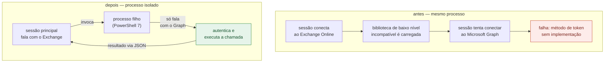
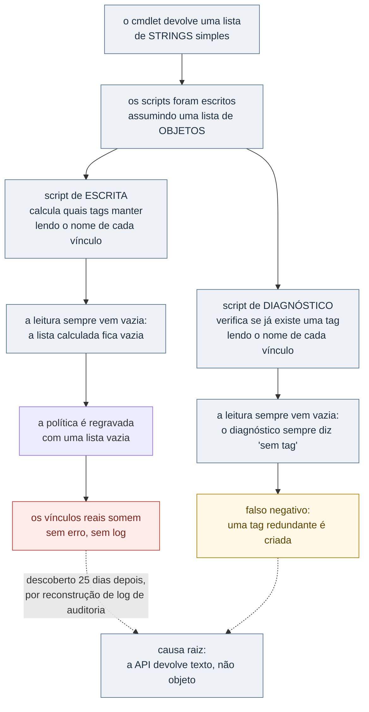

# O mesmo defeito, dois desfechos: consolidando 113 scripts de administração num módulo único

> **Status: RASCUNHO — sanitizado, ainda não publicado.**
> Razão social, domínios, nome de certificado, nome de caixa e nomes de função
> foram removidos ou generalizados. Os números agregados são reais.
>
> **Este é um projeto em andamento, não uma remediação fechada.** A
> autenticação e o isolamento de processo estão concluídos e validados; a
> consolidação central — levar ~113 scripts para dentro de um módulo único —
> está parcialmente feita. A seção 8 diz exatamente o que falta.

---

## Resumo

Um ambiente de administração de identidade e correio tinha **~113 scripts de
PowerShell soltos**, sem estrutura compartilhada — cada um com sua própria
lógica de conexão, algumas coexistindo em **quatro versões diferentes** da
mesma biblioteca, e um método de autenticação que a própria política de
segurança do tenant rejeitava.

Consolidar isso num módulo único revelou um padrão que vale um estudo à parte:
**a mesma suposição errada sobre o formato de uma resposta de API causou dois
desfechos muito diferentes**, com semanas de intervalo — uma vez como falso
negativo que só gerou ruído, e antes disso, uma vez como **escrita silenciosa
que apagou uma configuração real de produção**.

| Indicador | Valor |
|---|---|
| Scripts originais sem estrutura de módulo | ~113 |
| Versões conflitantes da mesma biblioteca coexistindo | 4 (Authentication) + 5 (Users) |
| Funções de módulo construídas e validadas | 9 |
| Espaço liberado no caso medido | ~49 GB / 66 mil itens |
| Dias até o bug de leitura ser encontrado | 25 |
| Dias em que tarefas agendadas falharam em silêncio | 4 |

---

## 1. Contexto

Ambiente de administração de identidade e correio de uma operação
corporativa, com:

- Autenticação Microsoft Graph e Exchange Online no mesmo posto de trabalho
- Tenant com política que **bloqueia client secret** em registros de
  aplicativo — toda automação precisa de certificado
- Scripts acumulados ao longo de meses, cada um resolvendo um problema
  pontual, sem convenção compartilhada de conexão, log ou tratamento de erro
- Pasta de módulos PowerShell dentro de uma pasta sincronizada por serviço de
  nuvem pessoal

Nenhum desses pontos, isolado, é grave. Juntos, formam o padrão clássico de
ferramenta interna que cresce mais rápido que o cuidado que recebe: cada
script novo copia a lógica de conexão do anterior, herdando qualquer defeito
que ele já carregasse.

## 2. O problema

Duas coisas quebravam ao mesmo tempo, por motivos diferentes.

**Dependência de versão.** O ambiente tinha simultaneamente **quatro versões**
de uma biblioteca de autenticação do Graph e **cinco versões** do módulo de
usuários. Os scripts fixavam a versão a carregar apontando para uma versão
**que não existia** na máquina. O resultado era previsível só em
retrospecto: cada script carregava a versão que encontrasse disponível, e
scripts diferentes acabavam carregando versões diferentes dentro da mesma
sessão.

**Autenticação bloqueada pela própria política do tenant.** A automação usava
um segredo de cliente salvo em arquivo. O tenant tinha política de **zero
client secrets** em registros de aplicativo — a chamada de autenticação
retornava erro de credencial inválida, e retornava isso **em produção**, não
em teste.

## 3. Alternativas consideradas e descartadas

| Alternativa | Motivo do descarte | Decisão |
|---|---|---|
| Autenticação por segredo de cliente | Bloqueada pela própria política do tenant | Descartada |
| Fixar a versão exata da biblioteca | A versão fixada não existia na máquina | Descartada |
| Graph e Exchange na mesma sessão | Conflito de assembly incompatível entre os dois SDKs | Descartada |
| Reduzir a idade da tag de retenção | O gargalo é o throttle do processo de arquivamento, não a idade do item | Descartada |
| Autenticação por certificado | — | **Adotada** |
| Graph isolado em processo filho | — | **Adotada** |
| Uma versão só por módulo | — | **Adotada** |

Duas decisões menores também vieram de tentativa e erro:

- **Verificar se uma política de retenção já tinha uma tag de arquivamento**
  lendo uma propriedade de nome de cada vínculo — descartada quando se
  descobriu que a coleção devolvida não são objetos com essa propriedade, são
  strings simples. É o bug central da seção 6.
- **Empilhar campos de formulário numa grade fixa**, na interface gráfica —
  trocada por um empilhamento de fluxo depois de bugs repetidos de
  dimensionamento de coluna.

## 4. A solução

### 4.1 Autenticação por certificado

A autenticação passou de segredo em arquivo para certificado — o único método
compatível com a política do tenant. Sem segredo em texto para vazar, e sem
depender de um arquivo de configuração sensível ao lado do script.

### 4.2 Isolar o Graph num processo filho

Este foi o problema mais difícil de diagnosticar. Uma sessão que já tinha
conectado ao Exchange Online e tentava, na sequência, autenticar no Microsoft
Graph, falhava com um erro de implementação ausente no método de obtenção de
token — sintoma que não aponta para a causa real.

A causa: o módulo de administração do Exchange Online carrega uma versão de
uma biblioteca de baixo nível **incompatível** com a que o SDK do Graph
espera, e no PowerShell 5.1 esse assembly **não é descarregado** depois de
carregado. Uma vez que a sessão carrega o Exchange, o Graph está condenado a
falhar naquele processo — não importa a ordem, não importa reconectar.

A solução não foi corrigir a incompatibilidade — ela está nas próprias
bibliotecas, fora de controle. Foi **isolar o Graph num processo separado**:
a sessão principal continua falando com o Exchange, e delega toda chamada ao
Graph a um processo filho recém-iniciado, que nunca carrega o módulo de
Exchange e por isso nunca herda o conflito. O resultado volta por um formato
de troca simples.

**Regra que ficou:** quando duas bibliotecas carregam versões incompatíveis
de uma dependência comum e uma delas não descarrega, a correção não é
escolher qual carregar primeiro — é não deixar as duas coexistirem no mesmo
processo.

### 4.3 Um módulo, não mais scripts soltos

Estrutura única, com configuração central e funções compartilhadas em vez de
lógica de conexão duplicada em cada script. Nove funções foram construídas e
validadas até aqui, cobrindo conectar aos serviços, atualizar e restaurar
usuário no diretório, executar desligamento, remover licença, auditar caixa
de correio, converter e renomear caixa compartilhada, e conceder acesso a
caixa.

## 5. Resultados

**Um caso de arquivamento resolvido e medido de ponta a ponta.** Uma caixa de
correio de cobrança financeira estava em cerca de **97 GB**, sem nenhuma tag
de arquivamento vinculada à política de retenção — o mecanismo nativo do
Exchange que move item antigo para o arquivo morto simplesmente não tinha
instrução para agir. Criada a tag e vinculada à política, o processo de
gerenciamento de pastas do Exchange moveu os itens sozinho, em dias:

| | Antes | Depois |
|---|---:|---:|
| Caixa principal | ~97 GB | ~48 GB |
| Arquivo morto | ~275 GB | ~325 GB |

Cerca de **49 GB e 66 mil itens** migrados, medidos por estatística de caixa
antes e depois. Reconciliou sem perda — o mecanismo de arquivamento é nativo
e atômico; ele move, não copia.

**O conflito de assembly está confirmado resolvido**, testado no cenário real
que antes falhava: sessão com Exchange carregado, chamada ao Graph isolada em
processo filho, sucesso.

**O que não está medido:** quanto dos ~113 scripts originais já migrou para
dentro do módulo, nem qualquer indicador de tempo economizado ou chamado
evitado. A consolidação central segue em andamento — ver seção 8.

## 6. O defeito que apareceu duas vezes

Esta é a parte mais instrutiva do projeto, e por isso ganha seção própria.

Um cmdlet do Exchange Online, ao listar os vínculos de tags de uma política
de retenção, devolve uma **lista de strings simples** — o nome de cada tag,
como texto puro. Dois scripts diferentes, escritos em momentos diferentes,
assumiram que essa lista continha **objetos** com uma propriedade de nome.
Ler essa propriedade inexistente num objeto que na verdade é uma string não
gera erro em PowerShell — devolve **vazio, em silêncio**.

O mesmo defeito, usado de dois jeitos, produziu dois resultados de gravidade
completamente diferente:

**A ocorrência mais grave veio primeiro, e foi a menos visível.** Um script
que decidia quais vínculos preservar numa política, usando essa leitura
quebrada, calculou uma lista vazia e regravou a política com ela por cima —
apagando os vínculos reais que já existiam. Nenhum erro, nenhum aviso.
Ninguém notou porque nada quebrou de forma visível: a política simplesmente
passou a não fazer nada, silenciosamente, até alguém precisar dela.

**A segunda ocorrência foi mais tarde, num script diferente, e foi só
ruído.** Ao investigar se uma caixa já tinha tag de arquivamento, a mesma
leitura quebrada respondeu "não" quando a resposta certa dependia do caso —
levando a criar uma tag redundante. Sem dano, mas com falsa confiança: o
diagnóstico dizia "esta caixa nunca foi configurada" para uma politica cujo
estado real ninguém conseguia enxergar através daquele código.

A causa raiz só foi encontrada quando alguém investigou por que a política
antiga não tinha efeito nenhum, e reconstruiu o histórico dela através do log
de auditoria unificado — o que revelou tanto o bug quanto o momento exato em
que a escrita destrutiva aconteceu, **25 dias antes**.

**Regra que ficou:** quando um cmdlet devolve uma coleção que parece
autoexplicativa, conferir o tipo real de cada elemento antes de ler uma
propriedade dela — `$x.GetType()` custa uma linha. E qualquer escrita
calculada a partir de uma leitura precisa de uma trava de sanidade: se a
política já tinha vínculos e nada pediu explicitamente para removê-los, uma
lista computada vazia é motivo de alarme, não de gravação.

## 7. Outras armadilhas operacionais

**Tarefa agendada que aponta para um caminho que deixa de existir.** O
executável do PowerShell 7 foi registrado numa tarefa agendada pelo caminho
que o sistema devolve na hora — um caminho que inclui a versão do pacote,
quando instalado por uma loja de aplicativos com atualização automática.
Quando o sistema atualizou o pacote, a pasta antiga sumiu e a tarefa passou a
falhar **silenciosamente, por 4 dias**, porque o processo nem chegava a
iniciar — não havia nada para gerar log. A correção foi usar um alias estável
de sistema em vez do caminho versionado.

**Erro de elevação escondido no meio da saída do console.** Um script de
registro de tarefa exigia privilégio elevado; sem ele, imprimia um erro e
encerrava — mas a mensagem se perdeu em meio a outras linhas de saída, e
quem rodou acreditou que o registro tinha funcionado. Só foi percebido
quando a tarefa não apareceu no agendador.

**Interface gráfica com campos sobrepostos.** Um contêiner de layout fixo
gerava bugs de dimensionamento de coluna repetidamente; a troca para um
contêiner de fluxo resolveu de forma definitiva.

## 8. O que ficou em aberto

A consolidação está longe de completa, e vale dizer com números:

- **A maior parte dos ~113 scripts originais ainda não entrou no módulo** —
  faltam o conjunto de conciliação com a base de RH e o service desk, o
  conjunto de scripts de auditoria, e os scripts que fazem operação
  destrutiva em e-mail (apagar, esvaziar, mover em massa). Há também **quatro
  pares de scripts duplicados** cuja versão manter ainda não foi decidida.
- **Cerca de 75 instalações antigas** da biblioteca de Graph, em várias
  versões, continuam espalhadas na árvore de módulos do PowerShell legado —
  não higienizadas.
- **A pasta de módulos continua dentro de uma pasta sincronizada por nuvem
  pessoal.** O risco de bloqueio de arquivo por sincronização concorrente foi
  identificado e nunca se materializou até aqui — mas segue não mitigado.
- Uma duplicidade de políticas de retenção na mesma caixa de cobrança segue
  sem decisão sobre eliminar uma delas.

## 9. Lições transferíveis

**Uma API que "parece" devolver objeto pode devolver texto, e PowerShell não
avisa.** Ler uma propriedade inexistente numa string não é erro — é `$null`
silencioso. Qualquer código que confia em uma propriedade de um resultado de
API deveria confirmar o tipo pelo menos uma vez, na primeira vez que aquele
cmdlet é usado.

**Nem todo falso negativo custa igual.** O mesmo defeito gerou ruído barato
numa ponta e apagou dado real na outra — a diferença não estava no defeito,
estava em qual das duas pontas tinha uma escrita depois da leitura errada.
Todo código que decide o que escrever com base numa leitura merece uma
verificação de sanidade contra o resultado degenerado (lista vazia,
`$null`, zero) antes de persistir.

**Ferramenta interna cresce por acréscimo, e multiplica defeito por cópia.**
Sem uma função compartilhada de conexão e leitura, cada script novo herdava
silenciosamente qualquer suposição errada que o script anterior já carregava
— inclusive esta.

**Caminho de executável versionado por atualização automática é frágil por
natureza para automação agendada.** Vale para qualquer ferramenta instalada
por uma loja de aplicativos: usar o alias estável, nunca o caminho que a
versão atual expõe.

## 10. Stack

**PowerShell 7** e **5.1** coexistindo por necessidade · **Microsoft Graph
SDK** com autenticação por certificado · **Exchange Online Management** ·
isolamento de chamada por **processo filho** com troca via JSON ·
**WinForms** para a interface gráfica · tarefa agendada do Windows ·
reconstrução de histórico via log de auditoria unificado.

---

## Apêndice — por que consolidar revelou o próprio defeito

Nenhum dos dois scripts que carregavam a suposição errada teria, sozinho,
levado à descoberta do bug. Um deles não tinha como saber que tinha apagado
algo — não gerava sintoma nenhum. O outro gerava só ruído, fácil de atribuir
a qualquer outra causa.

O bug só apareceu porque a consolidação forçou alguém a olhar os dois
scripts lado a lado, entender por que ambos liam a mesma coleção do mesmo
jeito, e perguntar se aquela leitura estava certa. **Consolidar ferramenta
não é só juntar código num lugar só — é criar a primeira oportunidade real de
comparar suposições que, espalhadas, nunca se encontrariam.**
